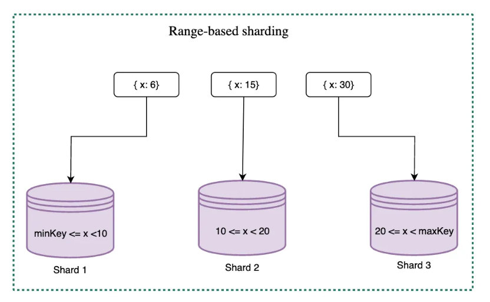
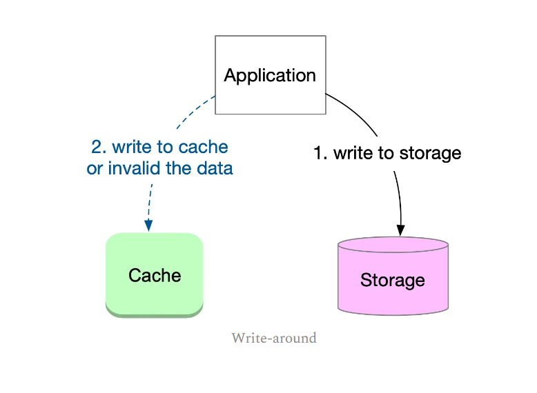

# Caching

- https://blog.bytebytego.com/p/a-crash-course-in-caching-part-1
- https://blog.bytebytego.com/p/a-crash-course-in-caching-part-2

## Intro

- Simple caching technique
  - When data is requested, the service first checks the cache for data
  - If the data is present in the cache, return it
  - If data not found, service retrieves if from storage, stores it in cache, and then returns 
    it to the client

### Differences between Caches and Storage

- Cache systems store frequently accessed data in memory
- Storage systems store data on disks
- Cache systems typically have a much smaller data capacity than storage systems because 
  memory is more expensive than disk
  - Caches can only store a subset of the total dataset

--------------

- Data stored in caches are not designed for long-term data persistence and durability
- Caches are used to increase performance

-------------

- Caches are optimized for supporting heavy traffic and high concurrency
- Storage systems are better suited for durably storing and managing large amounts of data

------------

- If data that is requested is available in the cache, it is known as a `cache hit`, otherwise 
  it is a `cache miss`
- System performs better when there are more cache hits
- `Cache hit ratio` is measure for cache effectiveness

-----------

- Caching is an effective solution where:
  - Data changes infrequently
  - The same data is accessed multiple times
  - Same output is produced repeatedly
  - Results of time-consuming queries or calculations are worth caching

## Cache Deployment

### In-process Cache

- Cache looked in app itself
- Limited data capacity and is restricted by memory size
- Cached data is lost if process restarts

### Inter-process Cache

- Local cache
- Runs in a separate process on the same machine
- No data loss when application process restarts
- No network cost
- Business logic and cache on the same host can complicate operation and maintenance costs
- Cached data will be lost if host crashes

### Remote Cache

- Cache deployed on separate machine
- Better scalability
- Easier to deploy and maintain
- Can be shared by multiple apps
- Accessing data requires a network call
- Redis and Memcached are typically deployed on remote machine

## Why do we need to cache

- Crucial to improve performance and reduce latency
- `Amdahl's law` states that the faster the cache is, the more speedup can be achieved
- By optimizing performance of the cache, the system can achieve greater speed and efficiency

-----------------

- Data access patterns likely follow the Pareto distribution (80/20 rule), where a small amount 
  of data is responsible for a large amount of traffic
- By caching this small amount of frequently accessed data, the cache can intercept most of the 
  requests, reducing load on the storage system

----------------

- Caching comes with a cost
- Requires more resources and adds complexity to system's implementation
- In a distributed env, maintaining data consistency and availability becomes a challenge, and 
  edge cases must be considered

## Cache replacement and invalidation

- Optimizing cache hits requires anticipating data access patterns and preloading the cache as 
  much as possible
- Predicting these patterns can be a challenging task
- `Principle of locality` cab be helpful here

--------------

- Temporal locality refers to tendency for recently accessed data to  be accessed again in the 
  near future
  - Example: trending tweet

--------------

- Spatial locality refers to the tendency for data that is close to recently accessed data to be 
  accessed soon after
  - Example, in a database, when a value is taken from a sequence, it is likely that the next 
    values in the sequence will be accessed later

### Cache replacement

- Best approach is to store most frequently accessed data in the cache in order to maximize its 
  effectiveness
- Several cache replacement policies
  - Least Recently Used (LRU)
    - discards the least recently used items first based on their last accessed timestamp
    - This is suitable for caching hot keys
  - Least Frequently Used (LFU)
    - Discards least frequently used items first based on their usage count
      - Used for caching trending tweets, and is often used in conjunction with LRU to filter 
        the most recent popular tweets
  - Allowlist policy
    - Data items in the allowlist will not be evicted from the cache
    - Suitable where popular data items cna be identified in advance and preloaded into the cache

### Cache invalidation

- Crucial process in maintaining data consistency between storage and cache
- When data is modified, updating both storage and cache simultaneously can be challenging
- Cache invalidation techniques are used to remove or refresh stale data in the cache

#### Invalidation when modifying

- Actively invalidating data in cache when the application modifies the data in storage
- Widely used technique

#### Invalidation when reading

- App checks validity of data when it is retrieved from cache
- If data is stale, read from storage and written to cache
- Can add more complexity to add

#### Time-to-live (TTL)

- App sets a lifetime for the cached data, and the data is removed or marked as invalid once the 
  TTL expires
- Popular option

## Distributed Caching

- Cached data is partitioned across many nodes, each node only storing a portion of the cached data

### Modulus Sharding

- This strategy is simple but can result in many cache misses when the number of shards is 
  increased or decreased 
  - This is because most of the keys will be redistributed to different shards when the pool is 
    resized

### Range-based Sharding

- Can be useful where data is naturally grouped or partitioned in specific ranges, such as 
  geolocation-based data or data related to specific customer segments
- Challenging to scale since number of shards is predefined and cannot be easily changed
- Changing number of shards requires redefining the key ranges and remapping the data

### Consistent Hashing

- What Cassandra uses
- Widely used
- Better load balance and fault tolerance

## Cache Strategies

- Cache strategies can be classified by the way they handle reading or writing data:
  - Read Strategies: Cache-Aside and Read-Through
  - Write Strategies: Write-Around, Write-Through, and Write-Back

### Read Strategies

#### Cache-aside

- Aka lazy loading
- App directly communicates with both cache and storage systems
- Works well for read-heavy workloads

- Pros
  - Can tolerate cache failures because app can still read from storage
  - Data model in cache can differ from that in storage - provides additional flexibility
- Cons
  - App must manage both cache and storage
  - Ensuring data consistency is challenging due to lack of atomic operations on cache and storage
- Important to other data consistency issues as well
  - If a piece of data is written to the cache, and the value in the storage is updated 
    afterward, the app can only read the stale value from the cache until it is evicted
  - One solution is to set an acceptable TTL
  - For more stringent data freshness requirements, can combine cache-aside with one of write 
    strategies discussed further down

#### Read-through

- Cache serves as intermediary between app and storage system
- Cache handles all read requests
- Cache is responsible with keeping itself in sync with storage

- Pros
  - App only needs to read from cache
- Cache
  - System cannot tolerate cache failures
  - Cache and storage system must share the same data model
- Data consistency can pose challenges
  - If the data in the storage is updated after being cached, inconsistencies can happen
  - Again, to solve this, can use one of the write strategies to ensure data consistency

### Write Strategies

#### Write-around

- Caching strategy for managing data writes
- Often combined with cache-aside or read-through strategies

- Pros
  - Intuitive and simple, effectively decouples cache and storage system
- Cache
  - If data is written once and then read again, the storage system will be accessed twice
  - When data is frequently updated and red, the storage system is accessed multiple times, 
    rendering cache operations less effective

#### Write-through

- Cache is responsible for writing data to storage and updating the cache accordingly
- Often combined with red-through to provide a consistent caching solution
- Well suited for situations where data is written once and read multiple times

- Pros
  - App only needs to write data to cache, simplifying the process and reducing complexity
  - Because data is first written to the cache, all read operations from the cache retrieve the 
    most recent data, making this strategy ideal for scenarios where data is written once and 
    reda multiple times
- Cons
  - Introduces write latency because operation is done on both cache and storage
  - If data is successfully written to the storage, but not updated in the cache, the cached 
    data becomes stale
    - Cache must first invalidate the key, then request to write the data to storage, and 
      finally update the cache only if the write operation succeeds
      - Ensures data will either be updated or invalidated

#### Write-back

- Write operations to the storage system are both async
- Often combined with read-through
- Some caches,such as Redis, use a write-back strategy for periodic persistence to an 
  append-only file (AOF)

- Pros
  - Offers lower latency compared to write-through, better performance for write operations
  - Strategy reduces overall number of writes to the storage system and provides resilience to 
    storage failures
- Cons
  - There may be a temporary data inconsistency between cache and storage systems - tradeoff for 
    better availability
  - If cache fails before writing data to storage, the latest updated records may be lost, which 
    is not acceptable in some scenarios
    - To mitigate the risk of data loss due to cache failures, cache systems can persist write 
      operations on the cache side

### Cache Strategy Combinations

- Popular combinations
  - Cache-aside & write-around
  - Read-through & write-through
  - Read-through & write-back
- Less common combinations
  - Read-through & write-around
  - Cache-aside & write-through